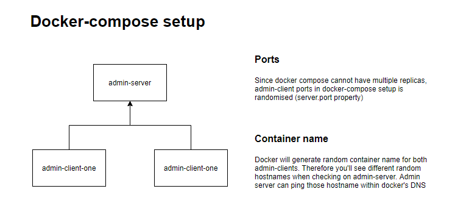
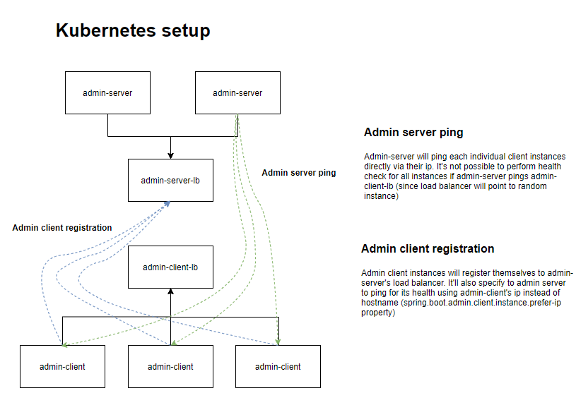

## spring-observability-admin

Simple repository to demo Spring Admin functionality
for [observability](https://microservices.io/patterns/observability/application-metrics.html)
. Has a `docker-compose` file that starts two instances of client that can be
tracked by `Spring Admin`

## How to run
### Docker-compose
1. Run `create-images.bat` to create images for both `admin client` and `admin server`
1. Run `start-compose.bat`  
1. Check result at http://localhost:8080/#/applications/spring-boot-application

### Kubernetes
1. Run `create-images.bat` to create images for both `admin client` and `admin server`
1. Run `kubectl apply -f kubernetes`
1. Check result at http://localhost:8080/#/applications/spring-boot-application

## Differences
### Docker-compose setup

### kubernetes setup

